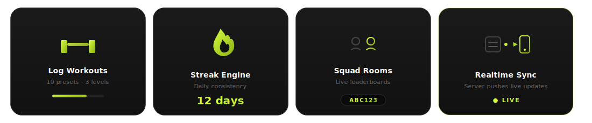
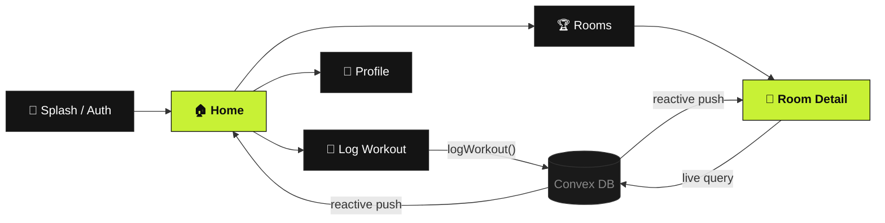
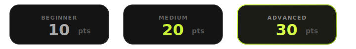
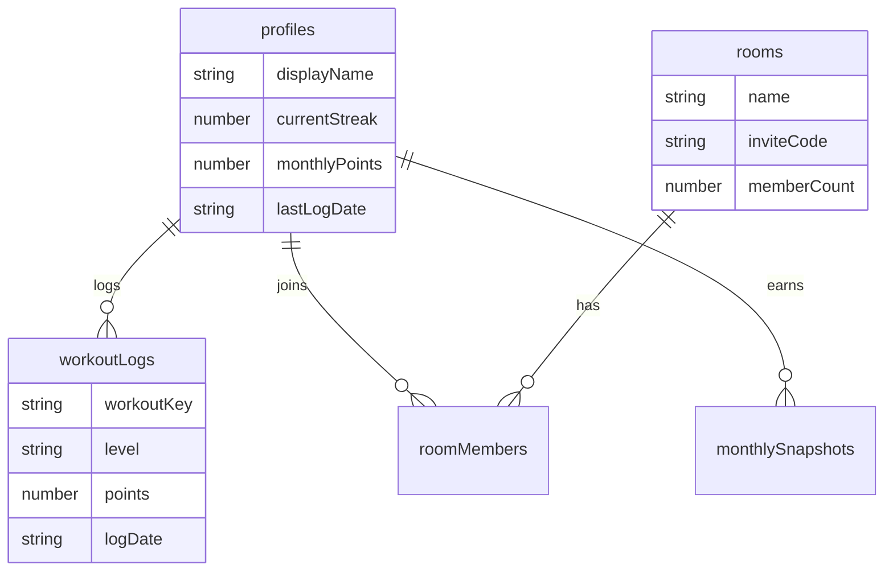

<p align="center">
  
</p>

<p align="center">
  A dark-mode fitness accountability app built with <strong>React Native</strong>, <strong>Expo</strong>, and <strong>Convex</strong>.
</p>

<p align="center">
  <!-- Dynamic shields -->
  
  
  
  
</p>

<p align="center">
  
  
  
  
</p>

---

## ✦ What is GrindRoom?

GrindRoom is a **fitness accountability app** where athletes log bodyweight workouts, earn points, maintain streaks, and compete in private **Rooms** (squads) with live monthly leaderboards.

<p align="center">
  
</p>

<table>
  <tr>
    <td width="50%" valign="top">

### 💪 Daily Workout Logger
- **10 workout presets** — push-ups, squats, planks, burpees & more
- **3 difficulty levels** — beginner, medium, advanced
- **Point system** — 10 / 20 / 30 pts per log
- **5-workout daily goal** with celebration animation

    </td>
    <td width="50%" valign="top">

### 🔥 Streaks & Points
- Streak increments when you log consecutive days
- Monthly points reset on the 1st (UTC cron)
- Historical snapshots with room rank preserved
- Animated counters & progress arcs on Home

    </td>
  </tr>
  <tr>
    <td width="50%" valign="top">

### 🏆 Squad Rooms
- Create or join rooms via **6-char invite codes**
- Live leaderboard sorted by `monthlyPoints → streak`
- Today's activity feed — see who logged in
- Up to **20 members** per room

    </td>
    <td width="50%" valign="top">

### ⚡ Realtime Everything
- Convex subscriptions — no manual refresh
- Google OAuth + email/password auth
- Rate-limited mutations for abuse protection
- Secure token storage via `expo-secure-store`

    </td>
  </tr>
</table>

---

## ✦ App Flow



---

## ✦ Tech Stack

<table>
  <thead>
    <tr>
      <th>Layer</th>
      <th>Technology</th>
      <th>Purpose</th>
    </tr>
  </thead>
  <tbody>
    <tr><td>📱 Mobile</td><td>React Native + Expo 54</td><td>Cross-platform app shell</td></tr>
    <tr><td>🧭 Navigation</td><td>Expo Router 6</td><td>File-based routing</td></tr>
    <tr><td>🗄️ Backend</td><td>Convex</td><td>Realtime DB, auth, crons</td></tr>
    <tr><td>🔐 Auth</td><td>@convex-dev/auth</td><td>Google OAuth + password</td></tr>
    <tr><td>🎨 Styling</td><td>NativeWind 4 + Tailwind</td><td>Utility-first classes</td></tr>
    <tr><td>✨ Motion</td><td>Reanimated 4</td><td>Spring animations & gestures</td></tr>
    <tr><td>🧠 UI State</td><td>Zustand</td><td>Local UI state only</td></tr>
    <tr><td>🔤 Icons</td><td>Lucide React Native</td><td>Consistent iconography</td></tr>
  </tbody>
</table>

### Design Tokens

| Token | Value | Usage |
|-------|-------|-------|
| `background` | `#0e0e0e` | App shell |
| `surface` | `#141414` | Cards |
| `accent` | `#C8F135` | Lime highlights |
| `danger` | `#FF6B51` | Destructive actions |
| `heading` | Oswald | Display text |
| `body` | Inter | UI copy |

---

## ✦ Project Structure

```
grindroom/
├── app/                    # Expo Router screens
│   ├── (auth)/             # Splash, login, signup
│   ├── (tabs)/             # Home, Rooms, Log, Profile
│   ├── room/[id]/          # Room detail + leaderboard
│   ├── create-room/        # Room creation flow
│   └── settings.tsx
├── components/
│   ├── animations/         # FadeIn, ScalePress, Skeleton, etc.
│   ├── GrindUI.tsx         # Shared design primitives
│   └── WorkoutCard.tsx
├── convex/                 # Backend
│   ├── schema.ts           # profiles, rooms, workoutLogs…
│   ├── workoutLogs.ts      # Logging + streak logic
│   ├── rooms.ts            # CRUD + join/leave
│   ├── leaderboard.ts      # Rankings + activity
│   ├── snapshots.ts        # Monthly freeze cron
│   └── lib/                # auth, rateLimit, validation
├── constants/              # workouts, theme
├── store/                  # Zustand UI store
└── assets/readme/            # README SVG assets
```

---

## ✦ Getting Started

### Prerequisites

- **Node.js** 18+
- **npm** or **pnpm**
- [Expo Go](https://expo.dev/go) (mobile testing) or Android/iOS simulator
- A [Convex](https://convex.dev) project

### 1 · Clone & install

```bash
git clone https://github.com/peterish8/grindroom.git
cd grindroom
npm install
```

### 2 · Environment variables

Create `.env.local` in the project root:

```env
EXPO_PUBLIC_CONVEX_URL=https://your-deployment.convex.cloud
```

### 3 · Run Convex backend

```bash
npx convex dev
```

### 4 · Start the app

```bash
npm start
```

Then press `a` for Android, `i` for iOS, or `w` for web.

### Build commands

| Command | Description |
|---------|-------------|
| `npm run android` | Run on Android device/emulator |
| `npm run ios` | Run on iOS simulator |
| `npm run web` | Start web dev server |
| `npm run build:preview` | EAS preview build (Android) |
| `npm run build:production` | EAS production build (Android) |
| `npm run submit` | Submit to Play Store |

---

## ✦ Scoring Rules

<p align="center">
  
</p>

**Leaderboard sort:** `monthlyPoints` ↓ then `currentStreak` ↓  
**Monthly reset:** 00:00 UTC on the 1st — scores frozen into `monthlySnapshots`

---

## ✦ Convex Schema (at a glance)



---

## ✦ Contributing

This is a private project. If you have access:

1. Branch from `main`
2. Keep commits focused
3. Run `npx convex dev` alongside `npm start` when touching backend code
4. Open a PR with a clear description

---

## ✦ Related Docs

- [`PRIVACY_POLICY.md`](./PRIVACY_POLICY.md) — data handling
- [`PLAYSTORE_SUBMISSION.md`](./PLAYSTORE_SUBMISSION.md) — Android release checklist
- [`CLAUDE.md`](./CLAUDE.md) — Convex AI agent guidelines

---

<p align="center">
  
</p>

<p align="center">
  <sub>© 2026 GrindRoom · <code>com.pratscodes8.grindroom</code></sub>
</p>